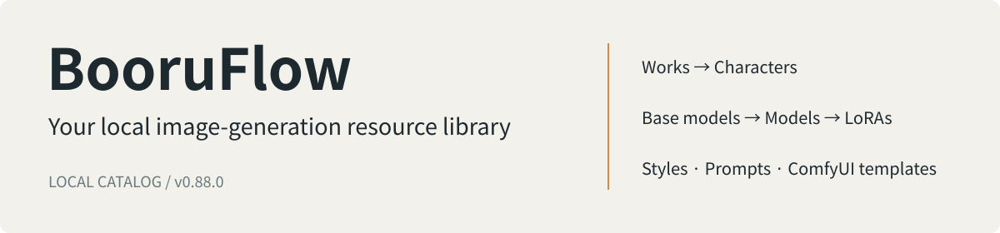

[中文](README.md) · [English](README.en.md) · [日本語](README.ja.md) · [Español](README.es.md)

# BooruFlow

BooruFlow is a locally running library for image-generation resources. Organize works, characters, styles, Prompt Tags, models, LoRAs and ComfyUI templates in one workspace, then retrieve resources through keyword and semantic queries.

Screenshots use a separate demonstration database. A fresh installation starts empty.

## What you can do

- **Connect resources:** link characters to works, models and LoRAs to base models, and artist prompt strings to styles.
- **Manage reference images:** upload, reorder, select covers and inspect original images.
- **Keep generation materials:** store prompts, trigger words, model file attributes and ComfyUI Workflow JSON.
- **Search and integrate:** filter resources in the management pages and connect external tools through Catalog/Source HTTP or CLI.
- **Move resource data:** export a directory, package it and import it once into an empty database. Import builds vectors synchronously and rolls back on failure.

The interface is currently in Chinese; documentation is available in four languages. The app is designed for one person running it locally. It stores model and LoRA catalog information; weight files stay in your own storage.

## Install and get started

Download the appropriate script from the [v0.88.0 release](https://github.com/fzfz/booruflow/releases/tag/v0.88.0):

| Platform | Installer |
|---|---|
| Windows x64 | Run [install.bat](https://github.com/fzfz/booruflow/releases/download/v0.88.0/install.bat) in a terminal |
| macOS Apple Silicon / Intel | Download [install.sh](https://github.com/fzfz/booruflow/releases/download/v0.88.0/install.sh), then run `bash install.sh` |

The script displays its starting working directory as the default installation directory. Press Enter to accept it or enter another path. It checks Node.js, npm and Git; if software is missing, it shows the required version and official download link. Install that software, then run the script again.

After installation, configure the embedding and rerank service URLs, model names and API keys in `.env`. The embedding model must produce **1024 dimensions**. See [configuration](docs/en/user/configuration.md).

Run `start.bat` or `bash start.sh` from the installation directory and open the displayed address. Create a base model in the base-model management page, then add models and styles. To use a data package, import it into an empty database while the app is stopped, then start the app. Follow the [quick start](docs/en/user/quick-start.md).

## Inside the workspace

| Prompt Tags | Models and LoRAs |
|---|---|
|  |  |

## Documentation, help and contributions

[Documentation](docs/en/README.md) · [Installation](docs/en/user/installation.md) · [Updates and recovery](docs/en/user/update-recovery.md) · [Data transfer](docs/en/user/data-transfer.md)

Start with [troubleshooting](docs/en/user/troubleshooting.md), then submit a [support request or bug report](https://github.com/fzfz/booruflow/issues/new/choose). Include the version, operating system, reproduction steps and checks you already tried.

Read the [contribution guide](docs/en/community/contributing.md) and [PR guidelines](docs/en/community/pull-requests.md) before contributing code or documentation. You can participate in Chinese, English, Japanese or Spanish.

[MIT license](LICENSE) · [Changelog](docs/en/CHANGELOG.md)
