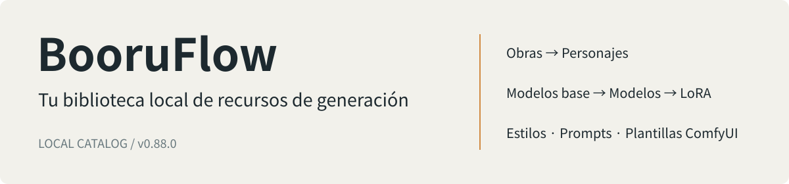

[中文](README.md) · [English](README.en.md) · [日本語](README.ja.md) · [Español](README.es.md)

# BooruFlow

BooruFlow es una aplicación local para gestionar recursos de generación de imágenes. Organiza obras, personajes, estilos, Prompt Tags, modelos, LoRA y plantillas ComfyUI en un mismo espacio, y recupera recursos mediante consultas por palabras clave y búsquedas semánticas.

Las capturas utilizan una base de datos de demostración independiente. Una instalación nueva comienza vacía.

## Qué puedes hacer

- **Relacionar recursos:** vincula personajes con obras, modelos y LoRA con modelos base, y cadenas de artistas con estilos.
- **Gestionar imágenes de referencia:** sube imágenes, cambia su orden, elige portadas y consulta los originales.
- **Guardar materiales de generación:** conserva prompts, palabras de activación, atributos de archivos de modelos y Workflow JSON de ComfyUI.
- **Buscar e integrar:** filtra recursos en las páginas de gestión y conecta herramientas externas mediante Catalog/Source HTTP o CLI.
- **Trasladar datos:** exporta un directorio, empaquétalo e impórtalo una sola vez en una base de datos vacía. La importación genera los vectores de forma síncrona y revierte los cambios si falla.

La interfaz está actualmente en chino y la documentación está disponible en cuatro idiomas. La aplicación está pensada para una persona que trabaja localmente. Guarda información de catálogo de modelos y LoRA; los archivos de pesos permanecen en tu almacenamiento.

## Instalación y primeros pasos

Descarga el script correspondiente de la [versión v0.88.0](https://github.com/fzfz/booruflow/releases/tag/v0.88.0):

| Plataforma | Instalador |
|---|---|
| Windows x64 | Ejecuta [install.bat](https://github.com/fzfz/booruflow/releases/download/v0.88.0/install.bat) en una terminal |
| macOS Apple Silicon / Intel | Descarga [install.sh](https://github.com/fzfz/booruflow/releases/download/v0.88.0/install.sh) y ejecuta `bash install.sh` |

El script muestra el directorio de trabajo inicial como destino predeterminado. Pulsa Enter para aceptarlo o escribe otra ruta. Comprueba Node.js, npm y Git; si falta alguno, muestra la versión necesaria y el enlace oficial de descarga. Instala el software y vuelve a ejecutar el script.

Después, configura en `.env` las URL, los nombres de modelo y las claves API de los servicios de embeddings y rerank. El modelo de embeddings debe producir **1024 dimensiones**. Consulta la [guía de configuración](docs/es/user/configuration.md).

Los comandos de raíz corresponden a v0.88.0 publicada. El código actual usa `bin/`; consulta [Directorios de scripts y mantenimiento](docs/es/development/scripts.md).

Ejecuta `start.bat` o `bash start.sh` desde la carpeta de instalación y abre la dirección indicada. Crea un modelo base en «底模管理» y añade modelos y estilos. Si tienes un paquete de datos, impórtalo en una base vacía con la aplicación detenida y arranca después. Sigue la [guía de inicio](docs/es/user/quick-start.md).

## El espacio de trabajo

| Prompt Tags | Modelos y LoRA |
|---|---|
|  |  |

## Documentación, ayuda y contribuciones

[Documentación](docs/es/README.md) · [Instalación](docs/es/user/installation.md) · [Actualización y recuperación](docs/es/user/update-recovery.md) · [Transferencia de datos](docs/es/user/data-transfer.md)

Consulta primero la [solución de problemas](docs/es/user/troubleshooting.md) y después envía una [consulta o informe de error](https://github.com/fzfz/booruflow/issues/new/choose). Incluye la versión, el sistema operativo, los pasos de reproducción y las comprobaciones realizadas.

Para contribuir código o documentación, lee la [guía de contribución](docs/es/community/contributing.md) y las [normas para PR](docs/es/community/pull-requests.md). Puedes participar en chino, inglés, japonés o español.

[Licencia MIT](LICENSE) · [Historial de cambios](docs/es/CHANGELOG.md)
