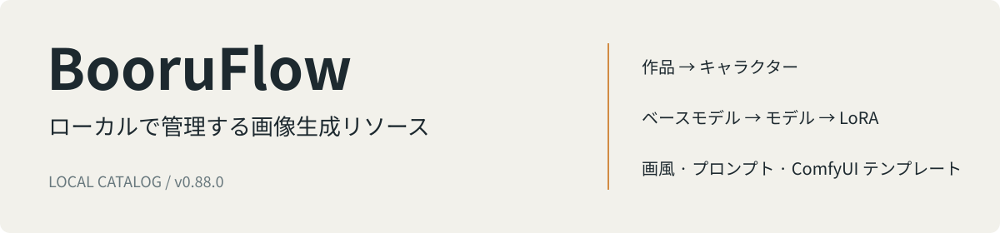
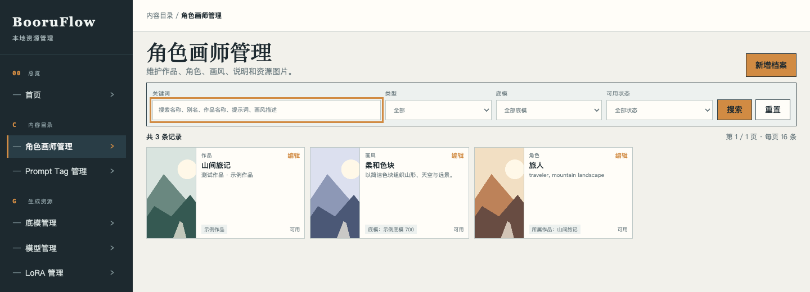
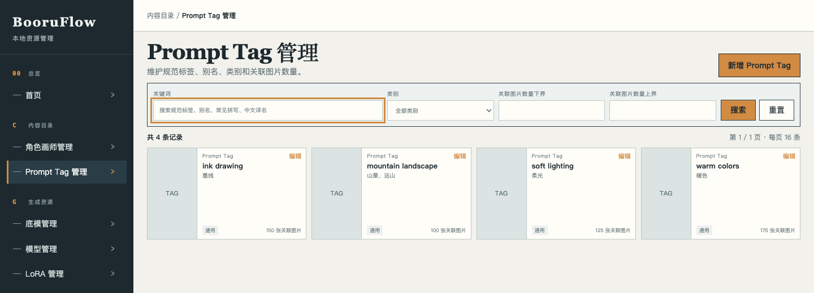
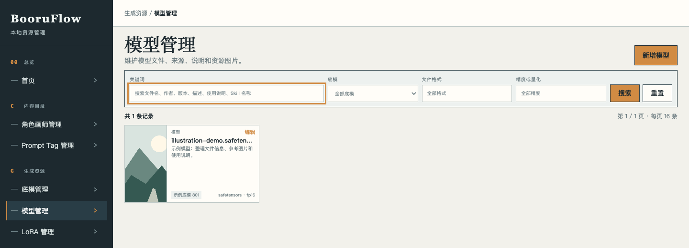
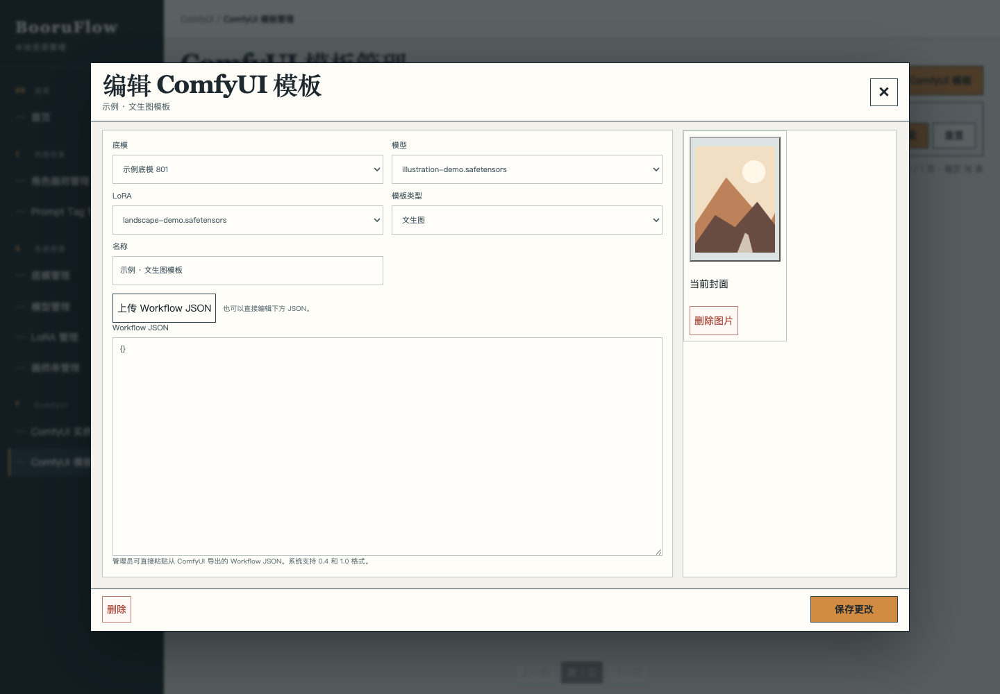

[中文](README.md) · [English](README.en.md) · [日本語](README.ja.md) · [Español](README.es.md)

# BooruFlow

BooruFlow は、ローカルで動作する画像生成リソース管理アプリです。作品、キャラクター、画風、Prompt Tag、モデル、LoRA、ComfyUI テンプレートを一つの作業画面で整理し、キーワード検索や意味検索で必要なリソースを探せます。

スクリーンショットには独立したデモ用データベースを使用しています。新規インストール時のデータベースは空です。

## できること

- **リソースの関連付け**：作品とキャラクター、ベースモデルとモデル・LoRA、画師プロンプト列と画風を関連付けます。
- **参考画像の管理**：画像をアップロードし、並べ替え、カバーの選択、原寸表示ができます。
- **生成用の情報を保存**：プロンプト、トリガーワード、モデルのファイル属性、ComfyUI Workflow JSON を保存します。
- **検索と連携**：管理画面で絞り込み、Catalog/Source HTTP または CLI で外部ツールと連携します。
- **データの移行**：データをディレクトリにエクスポートして梱包し、空のデータベースへ一括インポートします。インポート中にベクトルを生成し、失敗した場合はロールバックします。

画面は現在中国語です。ドキュメントは4言語に対応しています。一人でローカル利用するアプリで、モデルと LoRA のカタログ情報を管理します。重みファイルは利用者のストレージに保管します。

## インストールと使い始め方

[v0.88.0 リリース](https://github.com/fzfz/booruflow/releases/tag/v0.88.0)からスクリプトを取得します。

| 環境 | インストーラー |
|---|---|
| Windows x64 | [install.bat](https://github.com/fzfz/booruflow/releases/download/v0.88.0/install.bat) をターミナルで実行 |
| macOS Apple Silicon / Intel | [install.sh](https://github.com/fzfz/booruflow/releases/download/v0.88.0/install.sh) を保存し、`bash install.sh` を実行 |

スクリプトは起動時の作業ディレクトリを既定のインストール先として表示します。Enter で確定するか、別のパスを入力します。Node.js、npm、Git を確認し、不足があれば必要なバージョンと公式ダウンロード先を表示します。ソフトウェアをインストールしてから再実行してください。

インストール後、`.env` に埋め込みモデルと rerank モデルのサービス URL、モデル名、API キーを設定します。埋め込みモデルには **1024 次元**の出力が必要です。[設定ガイド](docs/ja/user/configuration.md)を参照してください。

本文のルート直下のコマンドは公開済み v0.88.0 用です。現在のソースの `bin/` パスは次を参照してください： [スクリプトの配置と保守コマンド](docs/ja/development/scripts.md).

インストール先で `start.bat` または `bash start.sh` を実行し、表示された URL を開きます。「底模管理」でベースモデルを作成し、モデルや画風を追加します。データパッケージを使う場合は、アプリ停止中に空のデータベースへインポートしてから起動します。詳しくは[クイックスタート](docs/ja/user/quick-start.md)をご覧ください。

## 作業画面

| Prompt Tag | モデルと LoRA |
|---|---|
|  |  |

## ドキュメント・質問・貢献

[ドキュメント](docs/ja/README.md) · [インストール](docs/ja/user/installation.md) · [更新と復元](docs/ja/user/update-recovery.md) · [データ移行](docs/ja/user/data-transfer.md)

問題が起きたら[トラブルシューティング](docs/ja/user/troubleshooting.md)を確認し、[質問または不具合報告](https://github.com/fzfz/booruflow/issues/new/choose)を送ってください。バージョン、OS、再現手順、実施済みの確認を記載します。

コードや文書への貢献には[貢献ガイド](docs/ja/community/contributing.md)と [PR ガイド](docs/ja/community/pull-requests.md)を利用してください。中国語、英語、日本語、スペイン語で参加できます。

[MIT ライセンス](LICENSE) · [変更履歴](docs/ja/CHANGELOG.md)
