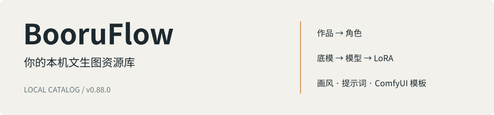

[中文](README.md) · [English](README.en.md) · [日本語](README.ja.md) · [Español](README.es.md)

# BooruFlow

BooruFlow 是一个本机运行的文生图资源管理应用。把作品、角色、画风、Prompt Tag、模型、LoRA 和 ComfyUI 模板整理在同一个工作台，用关键词和语义查询找回需要的资源。

截图来自独立演示数据库，安装后系统为空。

## 可以做什么

- **整理资源关系**：作品关联角色，底模关联模型与 LoRA，画师串关联画风。
- **管理参考图片**：上传图片、调整顺序、选择封面并查看原图。
- **维护生成材料**：保存提示词、触发词、模型文件属性和 ComfyUI Workflow JSON。
- **检索与集成**：通过管理页面筛选资源，使用 Catalog/Source HTTP 或 CLI 接入外部工具。
- **迁移资源数据**：导出目录、打包，并一次性导入空数据库；导入同步生成向量，失败时回滚。

应用界面目前为中文，文档提供四种语言。应用面向单人本机使用，保存模型和 LoRA 的目录信息；模型权重保留在你自己的存储位置。

## 安装与首次使用

从 [v0.88.0 Release](https://github.com/fzfz/booruflow/releases/tag/v0.88.0) 下载对应脚本：

| 平台 | 安装入口 |
|---|---|
| Windows x64 | [install.bat](https://github.com/fzfz/booruflow/releases/download/v0.88.0/install.bat)，在终端运行 |
| macOS Apple Silicon / Intel | [install.sh](https://github.com/fzfz/booruflow/releases/download/v0.88.0/install.sh)，运行 `bash install.sh` |

脚本显示启动时的当前目录作为默认安装目录。按回车接受，或输入其他目录。脚本检查 Node.js、npm 和 Git；缺少软件时显示版本要求和官方下载链接，由你安装后重新运行。

安装完成后，填写 `.env` 中的向量化与 rerank 服务地址、模型名和 API key。向量化模型须输出 **1024 维**。配置详情见[配置指南](docs/zh-CN/user/configuration.md)。

在安装目录运行 `start.bat` 或 `bash start.sh`，打开终端显示的地址。进入“底模管理”创建底模，再创建模型、画风等资源。已有数据包时，先在停机状态向空库导入成功，再启动应用。完整步骤见[首次使用](docs/zh-CN/user/quick-start.md)。

## 看看工作台

| Prompt Tag | 模型与 LoRA |
|---|---|
|  |  |

## 文档、求助与贡献

[完整文档](docs/zh-CN/README.md) · [安装](docs/zh-CN/user/installation.md) · [更新与恢复](docs/zh-CN/user/update-recovery.md) · [数据导出导入](docs/zh-CN/user/data-transfer.md)

遇到问题先按[排错指南](docs/zh-CN/user/troubleshooting.md)检查，再提交[使用求助或 Bug](https://github.com/fzfz/booruflow/issues/new/choose)。提交时提供版本、系统、复现步骤和已做的检查。

贡献代码或文档请阅读[贡献指南](docs/zh-CN/community/contributing.md)和 [PR 规范](docs/zh-CN/community/pull-requests.md)。可以用中文、英语、日语或西班牙语交流。

[MIT 许可证](LICENSE) · [变更记录](docs/zh-CN/CHANGELOG.md)
